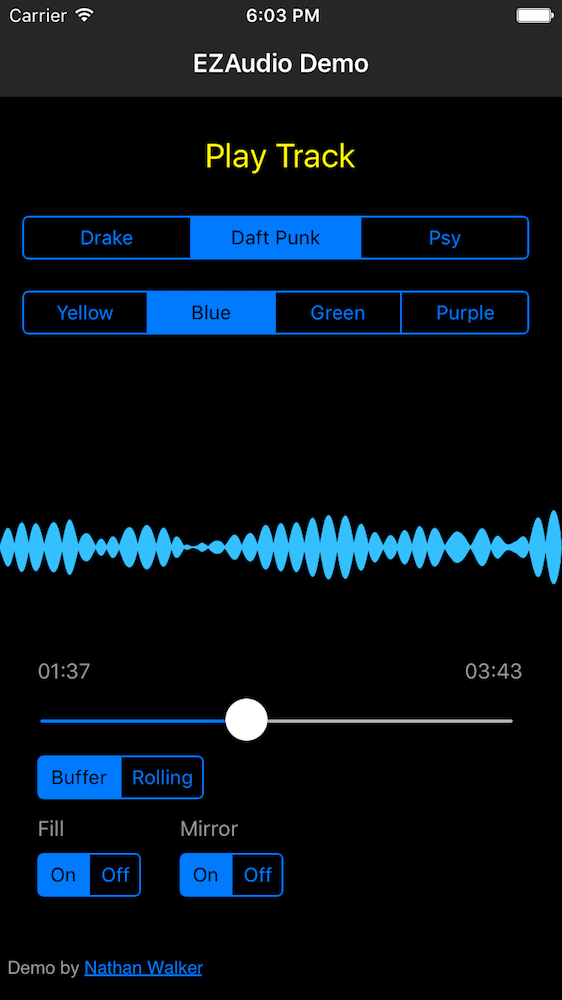

A NativeScript plugin for the simple, intuitive audio framework for iOS.
[EZAudio](https://github.com/syedhali/EZAudio)

* [Install](#install)
* [Usage](#usage)
* [Screenshots](#screenshots)
* [NSEZAudioPlayer](#nsezaudioplayer)
* [UI Components](#ui-components)
* [Try it/Contributing](https://github.com/NathanWalker/nativescript-ezaudio/blob/master/docs/CONTRIBUTING.md)

# Install

```
npm install nativescript-ezaudio --save
```

# Usage

**IMPORTANT:** *Make sure you include `xmlns:ez="nativescript-ezaudio"` on the Page element*

```
// main-page.xml
<Page xmlns="http://schemas.nativescript.org/tns.xsd" 
  xmlns:ez="nativescript-ezaudio"
  loaded="pageLoaded">
  <AbsoluteLayout width="100%" height="100%">
    <ez:AudioPlot 
      class="audioPlot" 
      color="{{audioPlotColor}}" 
      plotType="{{audioPlotType}}" 
      fill="{{audioPlotFill}}" 
      mirror="{{audioPlotMirror}}" 
      bufferData="{{audioPlotBufferData}}" />
    <Button text="{{btnTxt}}" tap="{{toggleCurrentTrack}}" />
  </AbsoluteLayout>
</Page>

// app.css
.audioPlot {
  width:100%;
  height:100%;
  background-color: #000;
  top:0;
  left:0;
}
button {
  font-size: 22;
  horizontal-align: center;
  margin:20px 0;
  color:#FFF803;
  top:20;
  left:0;
  width:100%;
}

// main-page.ts
import {AudioDemo} from "./main-view-model";

function pageLoaded(args) {
  var page = args.object;
  page.bindingContext = new AudioDemo(page);
}
exports.pageLoaded = pageLoaded;

// main-view-model.ts
import {Observable} from 'data/observable';
import {NSEZAudioPlayer} from 'nativescript-ezaudio';

export class AudioDemo extends Observable {
  public btnTxt: string = 'Play Track';
  
  // AudioPlot
  public audioPlotColor: string = '#FFF803';
  public audioPlotType: string = 'buffer';
  public audioPlotFill: boolean = true;
  public audioPlotMirror: boolean = true;
  public audioPlotBufferData: any;
  
  // internal
  private _player: any;
  private _currentTrackIndex: number = 0;
  private _tracks: Array<string> = [
    `any-mp3-you-like.mp3`,
  ];

  constructor(page: any) {
    super();
    this._player = new NSEZAudioPlayer(true);
    this._player.delegate().audioEvents.on('audioBuffer', (eventData) => {
      this.set('audioPlotBufferData', {
        buffer: eventData.data.buffer,
        bufferSize: eventData.data.bufferSize
      });
    });
  }

  public toggleCurrentTrack() {
    this._player.togglePlay(this._tracks[this._currentTrackIndex]);
    this.toggleBtn();  
  }
  
  private toggleBtn() {
    this.set(`btnTxt`, `${this._player.isPlaying() ? 'Stop' : 'Play'} Track`);
  }
}
```

## Screenshots

Sample 1 |  Sample 2
-------- | ---------
 | 

Sample 3 | Sample 4
-------- | -------
 | 

## NSEZAudioPlayer

AudioPlayer based on [EZAudioPlayer](https://github.com/syedhali/EZAudio#EZAudioPlayer).

Creating:
```
// Option 1: simple
this._player = new NSEZAudioPlayer();

// Option 2: advanced
// passing true to constructor will let the player know it should emit events
this._player = new NSEZAudioPlayer(true);

// it allows you to listen to events like so:
this._player.delegate().audioEvents.on('audioBuffer', (eventData) => {
  this.set('audioPlotBufferData', {
    buffer: eventData.data.buffer,
    bufferSize: eventData.data.bufferSize
  });
});

```

#### Methods

Event |  Description
-------- | ---------
`togglePlay(fileName?: string, reloadTrack?: boolean)`: `void` | Allows toggle play/pause on a track as well as reloading the current track or reloading in a new track. First time will always load the track and play. `fileName` represents the path to the file in your resources. `reloadTrack` can be used to reload current track or load a new track.
`pause()`: `void` | Pause track
`isPlaying()`: `boolean` | Determine whether player is playing a track
`duration()`: `number` | Length in seconds
`formattedDuration()`: `string` | Formatted duration in '00:00'
`totalFrames`: `number` | Total number of frames in the loaded track
`formattedCurrentTime`: `string` | Formatted current time in '00:00'
`setCurrentTime(time: number)`: `void` | Set the current time via a frame number
`seekToFrame(frame: number)`: `void` | Seek playhead to a given frame number
`volume()`: `number` | Get the current volume
`setVolume(volume: number)`: `void` | Set the volume. Must be between 0 - 1.
`pan()`: `number` | Get current pan settings
`setPan(pan: number)`: `void` | Set pan left/right. Must be between -1 (left) and 1 (right). 0 is default (center). 
`device()`: `any` | Get current output device

#### Events

Event |  Description
-------- | ---------
`audioBuffer` | When audio file is playing, get the `buffer` and `bufferSize` to set an `AudioPlot`'s `bufferData`
`position` | Current frame number
`reachedEnd` | When the end of the file is reached
`changeAudioFile` | When the audio file is changed or set
`changeOutput` | When the output device is changed
`changePan` | When the pan is changed
`changeVolume` | When the volume is changed
`changePlayState` | When the player state changes, ie. play/pause
`seeked` | When the audio file has been seeked to a certain frame number

## UI Components

### AudioPlot

Displays an audio waveform and provides attributes to modify it's display.

Example:
```
<ez:AudioPlot color="#fff" plotType="buffer" fill="true" mirror="true" bufferData="{{audioPlotBufferData}}" />
```

#### Attributes

Property |  Value
-------- | ---------
`color`: `string` | Color of waveform. Any rgb hex value, ie. #fff
`plotType`: `string` | `buffer` or `rolling`
`fill`: `boolean` | Makes waveform solid with color. When `false`, it appears more like lines.
`mirror`: `boolean` | Whether to mirror the waveform top/bottom.
`bufferData`: `Object` | An Object representing the audio file's `buffer` and `bufferSize`. See [example implementation](https://github.com/NathanWalker/nativescript-ezaudio/blob/master/demo/app/player/player-view-model.ts#L54-L59)
